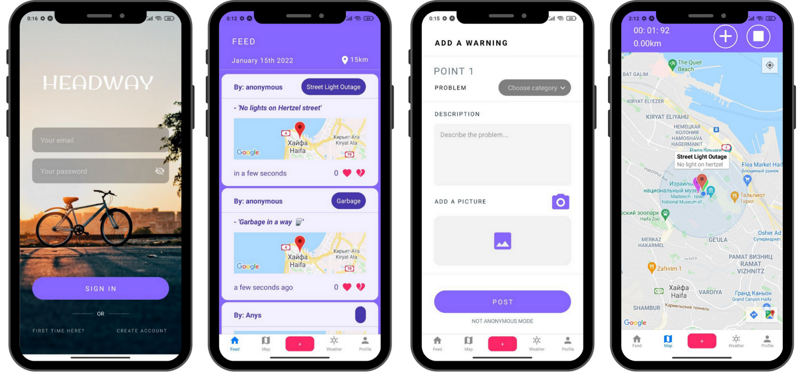

# Headway

Headway is a mobile application created for users of micro transportation like bikes and scooters. It was created as a part of the Hackathon competition in a few days by a group of talented full-stack developers. 

The application was created with an agenda to make the traveling experience inside cities more comfortable and predictable, thus contributing to the growth of green transportation, making the cities more walkable, and helping the municipalities improve the infrastructure according to travelers' needs.

## Table of contents

- [Overview](#overview)
  - [The challenge](#the-challenge)
  - [Screenshot](#screenshot)
- [Our process](#my-process)
  - [Built with](#built-with)
  - [What we learned](#what-i-learned)
  - [Continued development](#continued-development)
- [Authors](#author)
- [Acknowledgments](#acknowledgments)

## Overview

### The challenge

Users should be able to:

- View the optimal layout depending on their device's screen size
- Sign up and log in to the application
- View a feed of issues related to micro transportation in the area where they currently are
- Be able to upgrade or downgrade a post with a warning from other users.
- View a map with the issues pinned by other users
- Trace the route they are taking and view the time and distance they've traveled
- Post a warning about traffic/accident/road state for other users with coordinates, descriptions and a picture, that will appear in the feed for all the users around
- View the weather predictions to be able to understand the type of clothing, route or whether to use the other type of transport on that day
- View his profile information and log out if needed

### Screenshot

## Our process

### Built with

- CSS/HTML/JavaScript
- React Native
- Node.js
- Express
- MongoDB
- Heroku

### What we learned

- React Native
- Expo
- Socket.IO
- Integration of Google Maps API
- Integreation of OpenWeatherMap API
- IOS and Android adaptation

### Continued development

In the future we would like to add features as:

- Building a route avoiding the roads with issues pinned on the map by users
- Aggregating the data into readable form for municipalities to help improve the infrastructure according to users' needs
- Alarming notifications about recently added issues
- Saving the routes and displaying them for other users

## Authors

Jordan Avitan - @Ourcodingadventure

Magdalena Ben Bassat Luszczynska - @mag-d-alen

Ezra Rubio - @ezraRubio

Jared River - @jaredrivers

Anya Joy - @AnyaJoy

## Acknowledgments

This application was created thanks to ITC(Israel Tech Challenge) providing a Hackathon competition for students of Full-Stack and Data Science bootcamps.
